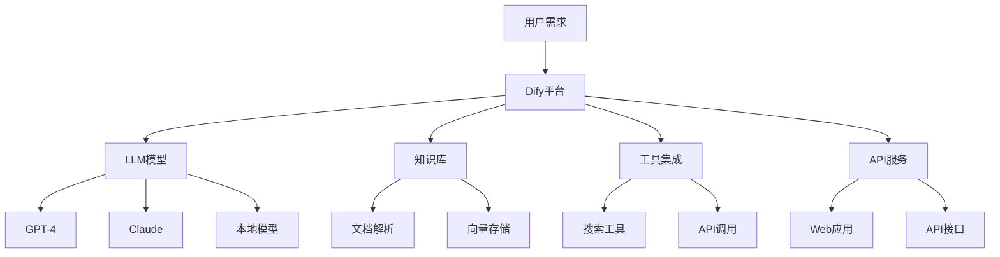

# 理解Dify：下一代AI应用开发平台

随着人工智能技术的快速发展，我们正处于一个AI应用爆发式增长的时代。在这个背景下，Dify作为一个创新的AI应用开发平台，正在帮助开发者和企业更轻松地构建和部署AI应用。

## AI技术发展的现状

### 大语言模型的崛起

自2022年ChatGPT发布以来，大语言模型（LLM）技术经历了前所未有的发展：

- **GPT系列**：OpenAI的GPT-3.5、GPT-4系列引领了对话AI的革命
- **开源模型**：LLaMA、Alpaca、Vicuna等开源模型降低了AI应用的门槛
- **多模态能力**：从纯文本扩展到图像、音频、视频的理解和生成

### AI应用开发的挑战

尽管AI能力强大，但开发者在构建实际应用时面临诸多挑战：

```bash
# 传统AI应用开发的痛点
- 模型集成复杂
- 提示工程困难
- 数据管理混乱
- 缺乏监控和优化工具
- 部署和扩展成本高
```

**主要技术障碍：**
- **模型选择和调用**：不同模型的API格式和能力差异很大
- **提示工程**：需要大量试验来优化提示词
- **数据处理**：文档解析、向量化、存储和检索复杂
- **应用架构**：缺乏标准化的AI应用开发框架

## Dify在AI生态系统中的位置

### 什么是Dify？

Dify是一个开源的LLM应用开发平台，旨在将AI能力民主化，让更多人能够轻松构建AI应用。



### 核心价值定位

**1. 降低AI应用开发门槛**
- 可视化界面，无需深度编程知识
- 拖拽式工作流设计
- 内置常用AI应用模板

**2. 统一的AI模型接入**
```python
# Dify统一了不同模型的调用方式
# 支持多种模型提供商
- OpenAI (GPT-3.5, GPT-4)
- Anthropic (Claude)
- 本地模型 (Ollama, LocalAI)
- 云端模型 (Azure OpenAI, AWS Bedrock)
```

**3. 企业级特性**
- 数据安全和隐私保护
- 多租户支持
- 详细的使用监控和成本控制
- SSO和权限管理

## Dify的核心功能

### 1. 应用构建器

**聊天助手构建**
```yaml
应用类型:
  - 客服机器人
  - 知识问答助手
  - 代码助手
  - 写作助手

配置选项:
  - 模型选择和参数调整
  - 系统提示词设计
  - 对话记忆管理
  - 响应格式控制
```

**工作流编排**
- 可视化流程设计
- 条件分支和循环
- 多步骤任务处理
- 外部API集成

### 2. 知识库管理

**文档处理能力**
```bash
支持格式:
├── PDF文档
├── Word文档  
├── Markdown文件
├── 网页内容
├── 结构化数据
└── API数据源
```

**智能检索**
- 向量检索
- 关键词搜索
- 混合检索策略
- 检索结果重排序

### 3. 模型管理

**多模型支持**
```javascript
// Dify支持的模型类型
const supportedModels = {
  textGeneration: ['gpt-4', 'gpt-3.5-turbo', 'claude-3'],
  embedding: ['text-embedding-ada-002', 'bge-large'],
  imageGeneration: ['dall-e-3', 'stable-diffusion'],
  speechToText: ['whisper-1'],
  textToSpeech: ['tts-1']
}
```

**模型性能优化**
- 自动提示词优化
- 响应质量评估
- 成本效益分析
- A/B测试支持

### 4. 开发者工具

**API生成**
```python
# Dify自动生成标准REST API
import requests

# 调用Dify应用API
response = requests.post(
    'https://api.dify.ai/v1/chat-messages',
    headers={
        'Authorization': 'Bearer your-api-key',
        'Content-Type': 'application/json'
    },
    json={
        'inputs': {},
        'query': 'Hello, how can you help me?',
        'user': 'user-123'
    }
)
```

**SDK支持**
- Python SDK
- JavaScript SDK
- 其他语言SDK正在开发中

## 实际应用场景

### 1. 企业知识助手

**场景描述**：为企业构建内部知识查询助手

```yaml
实现步骤:
1. 上传企业文档到Dify知识库
2. 配置文档解析和向量化
3. 设计查询优化的提示词
4. 部署为Web应用或API服务
5. 集成到企业内部系统

技术特点:
- 支持大规模文档处理
- 准确的信息检索
- 可追溯的答案来源
- 多语言支持
```

### 2. 客户服务机器人

**功能实现**：
- 自动回答常见问题
- 智能工单创建
- 多轮对话理解
- 人工转接机制

### 3. 内容创作助手

**应用领域**：
- 营销文案生成
- 技术文档写作
- 社交媒体内容
- 邮件模板生成

## 部署和最佳实践

### 部署选项

**1. 云端部署**
```bash
# 使用Dify云服务
- 官方托管版本
- 免费套餐可用
- 企业级付费方案
- 99.9%可用性保证
```

**2. 本地部署**
```bash
# Docker部署
git clone https://github.com/langgenius/dify.git
cd dify/docker
docker-compose up -d

# 支持的部署环境
- Docker容器
- Kubernetes集群  
- 云平台 (AWS, Azure, GCP)
- 私有云环境
```

### 最佳实践

**1. 数据安全**
- 敏感数据本地化处理
- 数据传输加密
- 访问权限控制
- 审计日志记录

**2. 性能优化**
```python
# 提示词优化示例
system_prompt = """
你是一个专业的技术文档助手。
请遵循以下原则:
1. 回答准确、简洁
2. 提供具体的代码示例
3. 引用相关文档来源
4. 使用中文回答
"""
```

**3. 成本控制**
- 合理选择模型类型
- 设置使用配额限制
- 监控API调用成本
- 优化提示词长度

## Dify vs 其他平台

### 与传统开发的对比

| 特性 | 传统开发 | Dify平台 |
|------|----------|----------|
| 开发时间 | 数周到数月 | 数小时到数天 |
| 技术门槛 | 高（需要AI/ML专业知识） | 低（可视化界面） |
| 模型集成 | 复杂的API对接 | 统一接口 |
| 维护成本 | 高 | 低 |
| 扩展性 | 需要大量开发工作 | 配置即可扩展 |

### 与其他AI平台的区别

**LangChain vs Dify**
- LangChain：开发者框架，需要编程
- Dify：可视化平台，降低门槛

**Azure AI Studio vs Dify**
- Azure：微软生态，企业级
- Dify：开源灵活，多云支持

## 未来展望

### 技术发展趋势

**1. 多模态AI应用**
- 图像、音频、视频的综合处理
- 更自然的人机交互方式

**2. AI代理（Agent）能力**
```python
# 未来的AI代理功能
agent_capabilities = {
    'planning': '任务分解和规划',
    'tool_use': '工具调用和集成', 
    'memory': '长期记忆管理',
    'learning': '持续学习优化'
}
```

**3. 边缘AI部署**
- 本地模型优化
- 离线AI应用支持
- 实时响应能力

### Dify的发展方向

**短期目标**：
- 更多模型提供商支持
- 增强的工作流功能  
- 移动端应用支持

**长期愿景**：
- 成为AI应用开发的标准平台
- 建立完整的AI应用生态系统
- 推动AI技术的普及和应用

## 总结

Dify作为一个创新的AI应用开发平台，正在改变我们构建和部署AI应用的方式。它不仅降低了AI应用开发的技术门槛，还提供了企业级的功能和性能。

**关键优势**：
- **易用性**：可视化界面，无需深度编程知识
- **灵活性**：支持多种模型和部署方式
- **完整性**：从开发到部署的全流程支持
- **开源性**：透明的技术架构，可自由定制

随着AI技术的持续发展，像Dify这样的平台将在AI应用的普及和创新中发挥越来越重要的作用。无论你是开发者、企业决策者，还是AI技术爱好者，了解和掌握Dify都将为你在AI时代的成功奠定坚实基础。

**下一步行动**：
1. 访问 Dify 官方网站，体验在线版本
2. 尝试构建你的第一个AI应用
3. 加入Dify社区，参与开源贡献
4. 关注AI技术发展，持续学习新知识

AI的未来已经到来，而Dify正在让这个未来变得更加触手可及。 